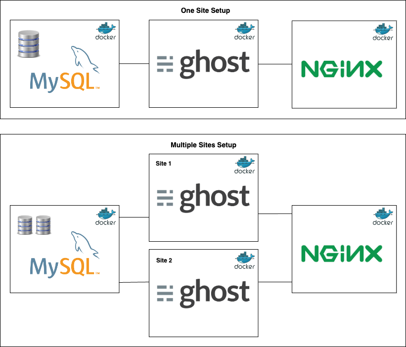

[](https://blog.xergioalex.com/)
[](https://github.com/TryGhost/Ghost)
[](https://github.com/xergioalex/ghostDocker/issues)
[](https://github.com/xergioalex/ghostDocker/network)
[](https://github.com/xergioalex/ghostDocker/)
[]()
[](https://twitter.com/xergioalex)


# Ghost docker configuration using nginx #

[]()

## Docker

#### Prerequisitos

Download && install **docker**
- [For Mac](https://download.docker.com/mac/stable/Docker.dmg)
- [For Windows](https://download.docker.com/win/stable/InstallDocker.msi)
- [For Linux](https://docs.docker.com/engine/getstarted/step_one/#docker-for-linux)

Download && install **docker compose**
- [Instructions](https://docs.docker.com/compose/install/)


#### Happy path for production in `local machine` environment

Just run:
```
cd docker/production
# without ssl
bash docker.sh up
# with ssl
bash docker.sh up secure
```

The docker configuration is explained in detail below.

#### Script bash and env vars

Go from console to the `docker/production` folder:
```
cd docker/production
```

In `docker/production` there is a bash script in the` docker.sh` file that can be run like this:
```
./docker.sh parameters
# Or
bash docker.sh parameters  // If you have a different bash shell like oh my zsh
```

There are serveral files with environment variables or config files to consider:
- `docker/production/.env` # Environment variables needed to run the bash script
- `docker/production/ghost/.env` # Ghost service environment variables
- `docker/production/mysql/.env` # Mysql service environment variables
- `docker/production/nginx/.env` # Nginx service environment variables
- `docker/production/nginx/site.template` # Nginx config site without ssl
- `docker/production/nginx/site.template.ssl` # Nginx config site with ssl

Files with environment variables `.env` and other config files mentioned below are ignored and will be created automatically from the `*.example` files.

#### Commands

**Notes:**
- Params between {} are optional, except {}*.
- Service names available: `Service names: ghost | mysql | nginx | cerbot`

The following describes each of the parameters::

**Usage: docker.sh [up|start|restart|stop|rm|sh|bash|logs|ps]**
* `deploy` --> Build and run services.
* `server.up {secure}` --> Build and run server (nginx) services; "secure" parameter is optional for ssl configuration
* `up {secure}` --> Build && deploy services; "secure" parameter is optional for ssl configuration.
* `start {service}` --> Start services.
* `restart {service}` --> Restart services.
* `stop {service}` --> Stop services.
* `rm {service}` --> Remove services.
* `sh {service}*` --> Connect to "service" shell.
* `bash {service}*` --> Connect to "service" bash shell
* `logs {service}* {n_last_lines}` --> Show "service" server logs
* `machine.[details|create|start|restart|stop|rm|ip|ssh]` --> Machine actions


#### Using Multi Sites Config

Followup similar steps for one site using the folder: 
- Go to folder: `cd docker/production_multi_sites`
- Setup `.env` vars
- Deploy containers: `bash docker.sh up`
- Setup mysql second database
- Re deploy containers: `bash docker.sh up`


**Create database for second site:**

To create a new database with a new user in MySQL, you can follow these steps:
1. Log in to MySQL as the root user: `mysql -u root -p`
2. Enter your root password when prompted.
3. Create a new database: `CREATE DATABASE dbname;`
4. Create a new user: `CREATE USER 'username'@'%' IDENTIFIED BY 'password';`
5. Grant privileges to the new user for the new database: `GRANT ALL PRIVILEGES ON dbname.* TO 'username'@'%';`
6. Flush the privileges to apply the changes: `FLUSH PRIVILEGES;`
Replace "dbname" with the name of your new database, "username" with the name of your new user, and "password" with a secure password for your new user.
Once you have completed these steps, you should be able to log in to MySQL using your new user credentials and access your new database.